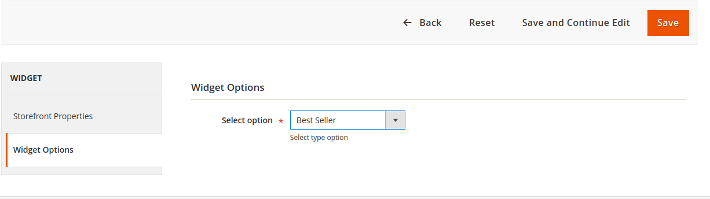

# Magento2 Best seller product slider

- In this module, we can create a slider by widget and in that slider, we can select a best-seller product, feature product, and new arrival product.

- First go to contant->widget and click on Add Widget

- Select widget type and theme and click on continue.

- Now click on widget options and select product type.

- You can also add widget on page

- Go to Content -> Pages, in Action Field in Grid click Select -> Edit for HomePage.(You can create your own page and use slider)
- Go to Content and Edit with Page builder
- Select HTML code from element Tab.
- Edit HTML code and click on Insert Widget.
- Select 'Best Seller Product' and Name it and Save.

## Manually Installation

Magento2 module installation is very easy, please follow the steps for installation-

=> Download and unzip the respective extension zip and create Bluethink(vendor) and BestSeller(module) name folder inside your magento/app/code/ directory and then move all module's files into magento root directory Magento2/app/code/Bluethink/BestSeller/ folder.

## Install with Composer as you go
Specify the version of the module you need, and go.
    
composer require bluethink/module-bestseller

## Run following command via terminal from magento root directory 
  
     $ php bin/magento setup:upgrade
     $ php bin/magento setup:di:compile
     $ php bin/magento setup:static-content:deploy

=> Flush the cache and reindex all.

now module is properly installed

## Contributing

Pull requests are welcome. For major changes, please open an issue first
to discuss what you would like to change.